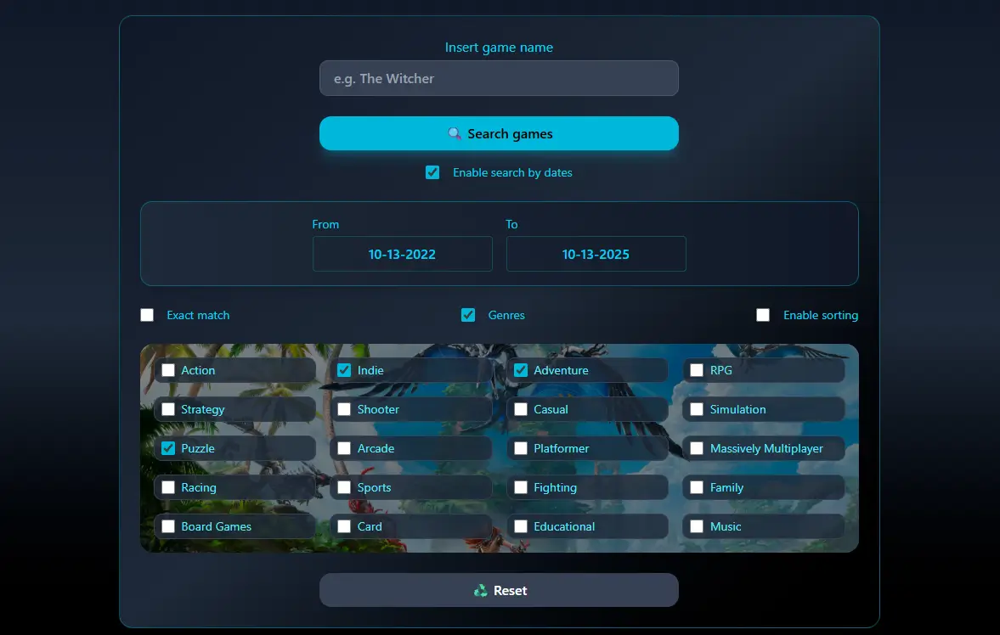
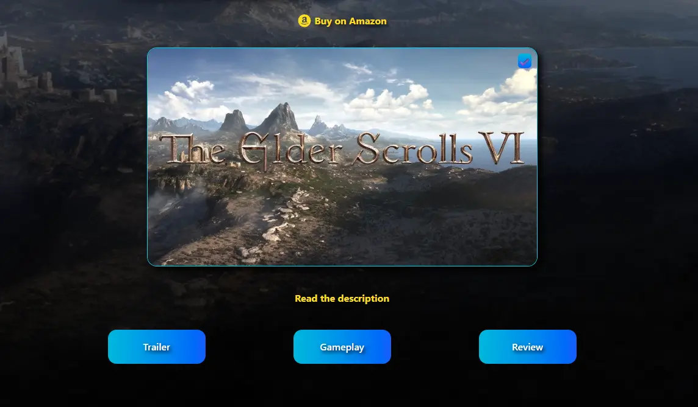
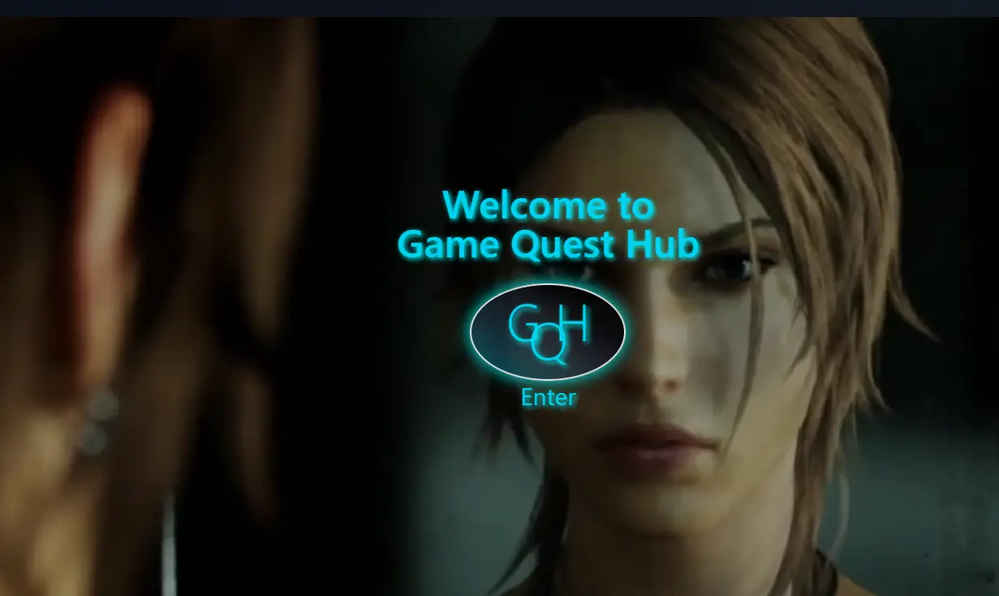
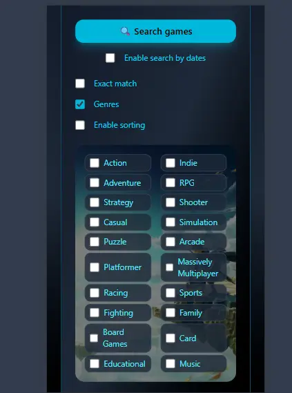

# 🎮 Game Quest Hub

**Game Quest Hub** is a modern React web application that allows users to explore, discover, and save their favorite video games.
It integrates real-time data from the **RAWG Video Games Database API** and **YouTube**, enabling users to search for games, watch official trailers, and manage their personalized game lists.

## 🚀 Features

* **Game Search** — Find games by title with detailed information including release date, genres, platforms, and more.
* **YouTube Trailers** — Watch gameplay or official trailers directly inside the app.
* **Favorites List** — Save your favorite games for quick access on the *My List* page.
* **Recommendations Page** — Browse a curated selection of 16 handpicked games.
* **User Authentication** — Secure sign-up and login using Firebase Authentication.
* **User Profiles** — Each user has a personalized profile stored in Firebase Firestore.
* **Accessibility Settings** — Improved readability, ARIA roles, and keyboard navigation.
* **Responsive Design** — Fully optimized for desktop and mobile using **Tailwind CSS**.

## 🧱 Tech Stack

| Category               | Technologies                                          |
| ---------------------- | ----------------------------------------------------- |
| **Frontend**           | React 18, React Router, Context API                   |
| **Styling**            | Tailwind CSS                                          |
| **Build Tool**         | Vite                                                  |
| **Backend / Database** | Firebase Authentication, Firestore                    |
| **APIs**               | RAWG API (for games), YouTube Data API (for trailers) |

## ⚙️ Installation

1. **Clone the repository**

   ```bash
   git clone https://github.com/yourusername/game-quest-hub.git
   cd game-quest-hub
   ```

2. **Install dependencies**

   ```bash
   npm install
   ```

3. **Set up environment variables**
   Create a `.env` file in the project root and add your API keys:

   ```bash
   VITE_RAWG_API_KEY=your_rawg_api_key
   VITE_YOUTUBE_API_KEY=your_youtube_api_key
   VITE_FIREBASE_API_KEY=your_firebase_api_key
   ```

   > You can obtain free API keys from [RAWG.io](https://rawg.io/apidocs) and [Google Cloud Console](https://console.cloud.google.com/).

4. ### Run the app locally

This project uses **Netlify serverless functions** for API communication, so running it with the default `npm run dev` may not work correctly.

Instead, use:

```bash
npx netlify dev

This command emulates the Netlify environment locally, including redirects, environment variables, and serverless functions.
   ```

## 🧩 Project Structure

src/
├── components/        # Reusable UI components (Navbar, Footer, GameCard, etc.)
├── pages/             # App pages (Home, MyList, Recommendations, Contact, etc.)
├── context/           # AppContext for global state
├── firebase/          # Firebase config and utilities
├── customHooks/       # Reusable React hooks
├── assets/            # Images and icons
└── App.jsx            # Main app component

---

## Authentication

* Sign up and login handled by **Firebase Auth**.
* User data (e.g., username, avatar) stored in **Firestore**.
* Protected routes ensure users can only access their own lists.

---

## 🗄️ Caching Implementation

To improve performance and reduce unnecessary API calls, **Game Quest Hub** implements caching for both RAWG and YouTube API requests using **Firebase Firestore**:

* **Firestore Caching**
  API responses are stored in a dedicated `cache` collection in Firestore. Each cached document contains:

  * `key` — a unique identifier for the request (e.g., game ID or search query)
  * `data` — the API response
  * `timestamp` — when the data was cached

* **Cache Expiration**
  Cached entries are considered valid for a predefined time (e.g., 24 hours). When fetching data:

  * If a valid cache exists in Firestore, the app returns the cached data.
  * If the cache is missing or expired, the app fetches fresh data from the API and updates Firestore.

* **How it works**

  1. Check Firestore `cache` collection for the requested key.
  2. If a cached document exists and is not expired, return the cached data.
  3. Otherwise, fetch from the API and store/update the document in Firestore.

* **Benefits**

  * Reduces API calls and avoids hitting rate limits
  * Enables faster load times for repeated searches or game detail requests
  * Ensures consistent data across devices for the same user

* **Example helper function** (simplified):

```js
import { doc, getDoc, setDoc } from "firebase/firestore";
import { db } from "../firebase";

const fetchWithFirestoreCache = async (key, fetchFunction, ttl = 86400000) => {
  const cacheRef = doc(db, "cache", key);
  const cacheSnap = await getDoc(cacheRef);

  if (cacheSnap.exists()) {
    const { data, timestamp } = cacheSnap.data();
    if (Date.now() - timestamp < ttl) return data;
  }

  const data = await fetchFunction();
  await setDoc(cacheRef, { data, timestamp: Date.now() });
  return data;
};
```

## 📷 Screenshots

Homepage (search page)


Avatar page
![Avatar] (./screenshots/avatar.webp)

Details page


Welcome page


Mobile


## Live Demo

> "https://gamequesthub.netlify.app/"

---

## Future Improvements

* Implement dark/light mode toggle
* Display user game statistics
* Add community reviews and ratings

## License

This project is open source and available under the **MIT License**.

### Affiliate Disclosure

Some game links may contain **Amazon affiliate URLs**.  
If you make a purchase through these links, a small commission may be earned at no additional cost to you.  
This helps support the project’s development.
